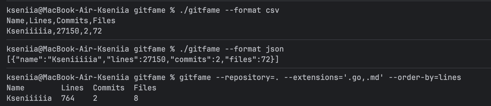

<div align="center">

# GitFame

[](https://golang.org/)
[](https://goreportcard.com/report/github.com/Kseniiiiia/gitfame)


**GitFame** — это консольная утилита для подсчёта статистики авторов в Git-репозитории. Она анализирует вклад каждого разработчика, показывая количество строк, коммитов и файлов.

</div>


## Содержание

- [Возможности](#-возможности)
- [Установка](#-установка)
- [Использование](#-использование)
- [Флаги](#-флаги)
- [Форматы вывода](#-форматы-вывода)
- [Фильтрация](#-фильтрация)
- [Примеры](#-примеры)
- [Как это работает](#-как-это-работает)
- [Сборка и разработка](#-сборка-и-разработка)
- [Тестирование](#-тестирование)

##  ⚙️ Возможности

- **Подсчёт статистики**: строки, коммиты и файлы для каждого автора
- **Гибкая фильтрация**: по расширениям, языкам программирования, glob-паттернам
- **Множество форматов вывода**: табличный, CSV, JSON, JSON-lines
- **Сортировка**: по строкам, коммитам или файлам
- **Поддержка коммиттеров**: можно использовать коммиттера вместо автора
- **Любая ревизия**: анализ любого коммита, ветки или тега
- **Прогресс-бар**: отображение прогресса выполнения (в stderr)

##  ⚙️ Установка

```bash
go install github.com/Kseniiiiia/gitfame
```


## ⚙️ Использование

```bash
# Базовое использование в текущем репозитории
gitfame

# Указать конкретный репозиторий
gitfame --repository /path/to/repo

# Анализ конкретной ветки или тега
gitfame --repository . --revision develop
gitfame --repository . --revision v1.0.0

# С фильтрацией по расширениям
gitfame --extensions .go,.md

# С фильтрацией по языкам
gitfame --languages go,markdown

# Вывод в разных форматах
gitfame --format csv
gitfame --format json
```

##  ⚙️ Флаги

| Флаг              | Описание                                              | Значение по умолчанию    |
|-------------------|-------------------------------------------------------|--------------------------|
| `--repository`    | Путь до Git репозитория                               | `.` (текущая директория) |
| `--revision`      | Указатель на коммит (ветка, тег, хэш)                 | `HEAD`                   |
| `--order-by`      | Ключ сортировки: `lines`, `commits`, `files`          | `lines`                  |
| `--use-committer` | Использовать коммиттера вместо автора                 | `false`                  |
| `--format`        | Формат вывода: `tabular`, `csv`, `json`, `json-lines` | `tabular`                |
| `--extensions`    | Список расширений (через запятую)                     | —                        |
| `--languages`     | Список языков (через запятую)                         | —                        |
| `--exclude`       | Glob паттерны для исключения (через запятую)          | —                        |
| `--restrict-to`   | Glob паттерны для включения (через запятую)           | —                        |

##  ⚙️ Форматы вывода

### Tabular (по умолчанию)
```
Name         Lines Commits Files
Joe Tsai     64    3       2
Ross Light   2     1       1
ferhat elmas 1     1       1
```

### CSV
```
Name,Lines,Commits,Files
Joe Tsai,64,3,2
Ross Light,2,1,1
ferhat elmas,1,1,1
```

### JSON
```json
[{"name":"Joe Tsai","lines":64,"commits":3,"files":2},
 {"name":"Ross Light","lines":2,"commits":1,"files":1},
 {"name":"ferhat elmas","lines":1,"commits":1,"files":1}]
```

### JSON Lines
```json
{"name":"Joe Tsai","lines":64,"commits":3,"files":2}
{"name":"Ross Light","lines":2,"commits":1,"files":1}
{"name":"ferhat elmas","lines":1,"commits":1,"files":1}
```

## ⚙️ Фильтрация

### По расширениям
```bash
# Только Go и Markdown файлы
gitfame --extensions .go,.md
```

### По языкам программирования
```bash
# Только Go и Python файлы
gitfame --languages go,python

# Поддерживаемые языки берутся из language_extensions.json
gitfame --languages go,markdown,cpp
```

### По glob-паттернам
```bash
# Исключить тестовые файлы
gitfame --exclude "*_test.go"

# Исключить несколько паттернов
gitfame --exclude "vendor/*,*_test.go"

# Включить только определенные файлы
gitfame --restrict-to "*.go,cmd/*"
```

### Комбинация фильтров
```bash
# Go файлы без тестов, сортировка по коммитам
gitfame \
  --extensions .go \
  --exclude "*_test.go" \
  --order-by commits \
  --format csv
```

## ⚙️ Примеры




##  ⚙️ Как это работает

Утилита использует Git команды для получения статистики:

1. **Получение списка файлов**: `git ls-tree -r --name-only <revision>`
2. **Анализ каждой строки**: `git blame --line-porcelain <revision> -- <file>`
3. **Обработка пустых файлов**: `git log -1 --format=%H <revision> -- <file>`

Каждой строке сопоставляется последний коммит, модифицировавший эту строку. Пустым файлам сопоставляются последние менявшие их коммиты.

##  ⚙️ Сборка и разработка

### Требования
- Go 1.25 или выше
- Git (для работы утилиты)


### Структура проекта

```
gitfame/
├── cmd/
│   └── gitfame/
│       └── main.go              # Точка входа
├── internal/
│   ├── blame/                    # Работа с git blame
│   ├── filters/                   # Фильтрация файлов
│   ├── output/                    # Форматы вывода
│   └── stats/                     # Сбор статистики
├── test/
│   └── integration/               # Интеграционные тесты
│       ├── gitfame_test.go
│       └── testdata/              # Тестовые данные
├── go.mod
├── go.sum
└── README.md
```

##  ⚙️ Тестирование

```bash
# Запуск всех тестов
go test -v ./...

# Только интеграционные тесты
go test -v ./test/integration/...
```